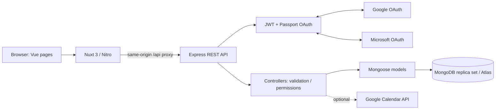
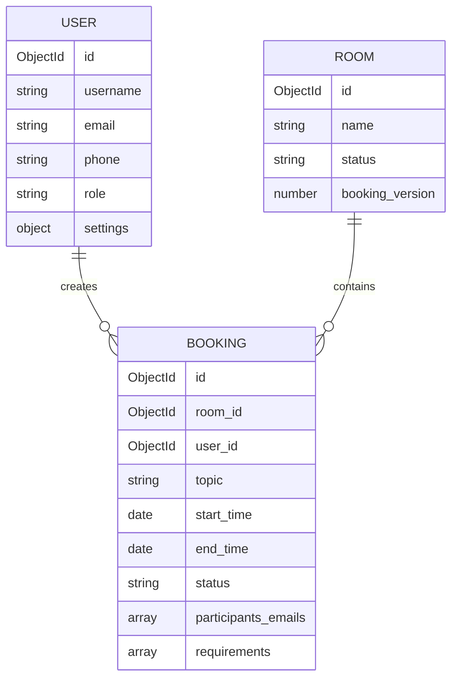
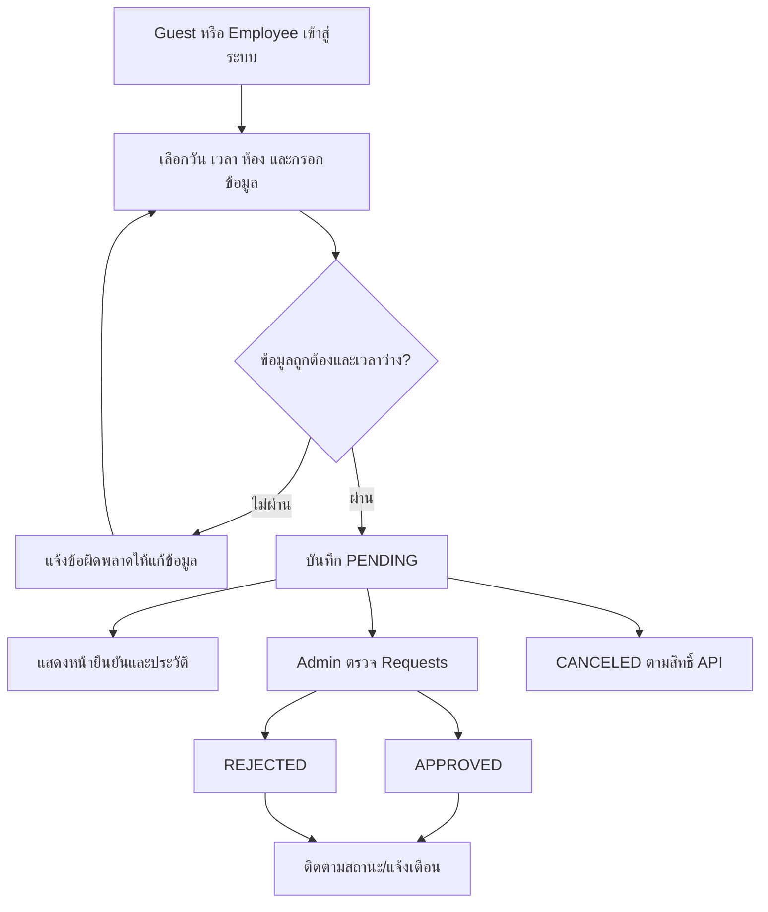

# Architecture และผลตรวจระบบ Arrangemeet

ตรวจจาก source, Git, GitHub deployment history, HTTP ของเว็บเดิม และการทดสอบในเครื่อง เมื่อ 15 กันยายน 2026

## 1. Repository และ deployment ที่พบ

- GitHub: https://github.com/SadBoySoyBad/Booking-room-continue
- Local HEAD ก่อนแก้: `7c15513` (Fix logout-login)
- `origin/main`: `33c617c` (merge PR #25); source tree ตรงกับ local HEAD ก่อนแก้
- Frontend เดิม: https://booking-room-continue.vercel.app — HTTP 200, Nuxt, Server: Vercel
- Backend ที่หน้าเว็บเดิมเรียก: https://booking-room-continue-backend.vercel.app
- Backend เดิมตอบ `FUNCTION_INVOCATION_FAILED` ทั้ง `/api/healthz` และ `/api/rooms`
- ล่าสุดผู้ใช้สร้าง Atlas ใหม่ `booking.7uebkhr.mongodb.net`; เชื่อมจริงและ initialize database `booking` แล้ว Local Docker ใช้ Atlas ใหม่นี้ผ่าน Compose override; ยังไม่ได้เปลี่ยน Vercel
- GitHub มี production deployment สำเร็จของทั้งสอง project วันที่ 4 ธันวาคม 2025 การ deploy สำเร็จในอดีตไม่ได้ยืนยันว่า API ยังทำงานในวันนี้
- Runtime Log ที่ผู้ใช้ส่งยืนยัน `querySrv ENOTFOUND _mongodb._tcp.booking.vs1tbkz.mongodb.net` แล้ว process exit 1; ตรวจ SRV ผ่าน DNS 1.1.1.1/8.8.8.8 ได้ NXDOMAIN เช่นกัน ต้องตรวจสถานะ cluster/hostname ใน Atlas
- ไม่มี project link หรือ session เบราว์เซอร์ที่เชื่อมต่อบัญชี Vercel/Atlas ในสภาพแวดล้อมนี้ จึงยังเปลี่ยน environment หรือกู้ cluster ผ่านบัญชีจริงไม่ได้

หลักฐาน deployment: [Frontend](https://api.github.com/repos/SadBoySoyBad/Booking-room-continue/deployments/3421328287/statuses), [Backend](https://api.github.com/repos/SadBoySoyBad/Booking-room-continue/deployments/3421341692/statuses)

## 2. ภาพรวมหลังแก้

เป็น monorepo แบบแยก frontend/backend ไม่มี microservices, message queue หรือ background worker

### Frontend (`front/`)

| ส่วน | หน้าที่ |
|---|---|
| Nuxt 3, Vue 3, Vue Router | SSR, hydration และ routing ตามไฟล์ใน `pages/` |
| Nitro | server ของ Nuxt และ proxy `/api/**` ไป Express |
| `server/utils/backendProxy.ts` | ส่ง HTTP redirect และ Set-Cookie กลับ browser โดยไม่ตาม OAuth redirect ใน server |
| Tailwind CSS ผ่าน `@nuxtjs/tailwindcss` | หน้าตาและ responsive classes เดิม |
| `layouts/default.vue`, `AdminLayout.vue`, `blank.vue` | header/navigation และ layout ของแต่ละกลุ่มหน้า |
| `useAuth.ts` | shared user state, ตรวจ session และ logout |
| `useApi.js` | เรียก API พร้อม cookie หรือ Bearer token และจัดการ HTTP errors |
| `auth.js`, `auth-admin.js` | client navigation guards; สิทธิ์ข้อมูลจริงตรวจซ้ำที่ backend |
| `auth-init.ts` | โหลดผู้ใช้เมื่อเปิดแอปและติดตาม token ข้ามแท็บ |
| `usePendingRequestsCount.js` | จำนวนคำขอรออนุมัติ polling ทุก 30 วินาที |
| `BookingModal.vue` | วันที่/เวลา ห้อง ผู้จอง ผู้เข้าร่วม และอุปกรณ์ |
| `useCsvExport.js` | export ตาราง โดย escape CSV และป้องกัน formula injection |

หน้าใช้งาน: `/`, `/login`, `/booking`, `/bookingconfirm`, `/history`, `/terms`, `/privacy` และ `/admin/{dashboard,analytics,requests,manage-accounts,manage-rooms,activities,settings}`

อัปเดต Nuxt ภายใน major 3 เดิม พร้อม lockfile ถอด modules ที่ไม่มีการใช้งานจริง ได้แก่ Content/SQLite, UI components, Fonts, Icon, Image, Scripts และ test-utils รวมถึง Passport ฝั่ง frontend ทั้งหมดนี้ไม่ได้เป็นฐานข้อมูลหรือระบบ login ที่ใช้งานจริงของแอป

### Backend (`back/`)

| ชั้น | ไฟล์ / หน้าที่ |
|---|---|
| Entry | `server.js` สำหรับ Node/Docker; `app.js` export Express สำหรับ Vercel |
| Configuration | `config/env.js` โหลด environment โดยไม่ขึ้นกับ current directory |
| HTTP | Express 4, CORS allow-list, JSON body limit, response แบบไม่ cache |
| Authentication | JWT, cookie-session สำหรับ OAuth state, Passport Google/Microsoft |
| Authorization | `authMiddleware` โหลด user ล่าสุดจาก DB; `authorizeRoles` จำกัด admin |
| Routes | `routes/*Routes.js` จับคู่ URL กับ controller |
| Controllers | validate request, ตรวจ role/เจ้าของข้อมูล, ตอบ status และ JSON |
| Models | Mongoose schema/query ใน `models/` |
| DB connection | `db.js` reuse connection, ไม่ exit process หรือ drop indexes ตอนรับ request |
| Calendar | `services/calendarService.js`, เปิดด้วย `GOOGLE_CALENDAR_ENABLED=true` |
| Utilities | `utils/dates.js` ใช้ขอบเขตวัน Asia/Bangkok; `utils/http.js` กรองข้อมูลลับและแปลง error |

ใช้ Node 22.12+ สำหรับชุด dependency ที่อัปเดต Docker ใช้ Node 22

## 3. ข้อมูลและความสัมพันธ์

- `users`: guest/employee/admin, password hash สำหรับ local credentials, provider IDs/tokens, company และ settings
- `rooms`: ชื่อ unique, สถานะ AVAILABLE/OCCUPIED/MAINTENANCE
- `bookings`: ผู้จอง ข้อมูลติดต่อ เวลา UTC, room/user references, ผู้เข้าร่วม อุปกรณ์ และสถานะ
- API ส่ง `id`, `room_id`, `user_id` เป็น string สม่ำเสมอ ไม่อาศัย virtual `id` จาก `lean()`
- MongoDB ไม่มี foreign-key constraint แบบ SQL จึงตรวจห้องและรักษาประวัติใน application ห้องที่มีประวัติให้ใช้ maintenance แทนการลบ
- คอลัมน์ optional แบบ unique ไม่บันทึก `null` ซ้ำ; `npm run db:init` มี migration สำหรับข้อมูลเดิมและ indexes
- ชื่อแสดงผลผู้ใช้ซ้ำได้ อีเมล/เบอร์/provider IDs เป็น identifiers ตามประเภทบัญชี

`db_init/*.sql`, Nginx/Certbot และคู่มือ Rukcom เดิมเป็นหลักฐานระบบ MariaDB รุ่นก่อน commit `962c0cf` ปัจจุบัน models ไม่ได้ใช้ SQL แล้ว

## 4. ลำดับงานเดิม

ไม่พบไฟล์ BPMN อย่างเป็นทางการใน repository แผนภาพนี้สรุปจาก implementation การรับคำขอและรอ admin อนุมัติยังเหมือนเดิม

### ป้องกันจองซ้อน

ใช้ MongoDB transaction และเขียน `booking_version` ของห้องก่อนตรวจช่วงเวลาเพื่อให้ผู้จองห้องเดียวกันพร้อมกันเกิด write conflict แล้ว retry จากข้อมูลล่าสุด ตรวจ overlap ด้วย `existing.start < new.end && existing.end > new.start` เฉพาะ PENDING/APPROVED การอนุมัติ/เปิดสถานะกลับตรวจอีกครั้ง เวลาต่อกันพอดีจองได้

ต้องใช้ MongoDB replica set หรือ Atlas; standalone MongoDB ไม่รองรับ transaction นี้ Docker Compose จัด replica set ให้

### เวลา

Frontend ส่ง ISO datetime ที่มี `+07:00` ชัดเจน MongoDB เก็บ UTC ส่วน query รายวันใช้เที่ยงคืนถึงเที่ยงคืนถัดไปของกรุงเทพฯ และนับรายการที่คร่อมวันด้วย

## 5. API และสิทธิ์

| Endpoint | สิทธิ์ / ผลลัพธ์ |
|---|---|
| GET `/api/healthz` | process ยังตอบ HTTP |
| GET `/api/readyz` | ping MongoDB; 503 เมื่อไม่พร้อม |
| POST `/api/users/guest-login` | guest ชื่อ/เบอร์; ไม่สามารถสวมบัญชี employee/admin |
| POST `/api/users/employee-login` | legacy local email/password; ไม่รับ mock provider assertion |
| GET `/api/auth/google`, `/microsoft` | เริ่ม provider OAuth พร้อม state |
| GET `/api/auth/{provider}/callback` | ตรวจ state และแลก token กับ provider |
| GET `/api/auth/myinfo`, `/verify` | ตรวจ cookie หรือ Bearer; ไม่คืน password/provider tokens |
| POST `/api/auth/logout` | ล้าง auth และ OAuth-state cookies |
| GET `/api/rooms`, `/:id` | รายการห้องและสถานะ |
| POST/PUT/DELETE `/api/rooms[/id]` | admin |
| POST `/api/bookings` | ผู้ใช้ที่ login; validate และจองด้วย transaction |
| GET `/api/bookings?status=PENDING` | admin |
| GET `/api/bookings/daily/:date` | ผู้ใช้ login; ซ่อนรายละเอียดของผู้อื่น |
| GET `/api/bookings/my-history`, `/notifications` | เฉพาะเจ้าของจาก authenticated user ID |
| PUT `/api/bookings/:id/status`, DELETE `/:id` | admin |
| GET/POST/PUT/DELETE `/api/users[/id]` | admin; รองรับ role, page, limit, q และ paginate |
| GET/PUT `/api/users/settings` | admin; บันทึก preference ลง MongoDB |
| GET `/api/analytics/summary` | admin; totals, leaderboard, monthly counts และจำนวนตาม role |

## 6. สิ่งที่แก้และตรวจแล้ว

- ติดตั้ง dependency/lockfile ให้ตรงกัน และแก้จุดเริ่มต้นฐานข้อมูล
- แก้ ID ที่หายหลังย้าย MongoDB ส่งผลต่อ login, ห้อง, ประวัติ และการอนุมัติ
- แก้ guest impersonation ของ employee/admin และยกเลิก Microsoft mock login
- เชื่อม user CRUD/settings routes และปุ่มจัดการบัญชี/อนุมัติ/แบ่งหน้า/filter/export
- รองรับ Google cookie auth ใน history/admin/notifications พร้อม proxy ที่ frontend origin
- ส่ง participants field ตรงกัน, ตรวจ datetime, overlap และสถานะซ้ำแบบ idempotent
- เปลี่ยน notification จำลองเป็นข้อมูลของผู้ใช้จริง
- แก้การ refresh Google token ไม่ให้ลบ provider ID/refresh token และแยก OAuth client ต่อ request
- แก้จำนวน chart ที่หารด้วยศูนย์, role ของ activity และ mapping statistics
- แก้ Docker จาก MariaDB เป็น MongoDB replica set และแยก secret ออกจาก image/frontend config

ผลทดสอบที่ทำในเครื่อง:

1. Backend tests 20 กรณี ใช้ MongoDB จริง รวม 8 concurrent requests ที่บันทึกสำเร็จ 1 และ conflict 7 และโหมด production/Passport ด้วย provider stub; frontend proxy tests อีก 4 กรณี
2. Vue SFC ทุกไฟล์ parse/compile ผ่าน และ Nuxt TypeScript typecheck ผ่าน
3. Nuxt production build และ Vercel preset ผ่าน; Docker build ทั้งสอง image ผ่าน; handler จาก Vercel build ส่งหน้าเว็บ/readiness/rooms 200 และ OAuth 302 พร้อม cookies
4. Browser walkthrough: Guest login → booking → confirmation → history; guest เข้า admin ไม่ได้; admin โหลดทุกหน้าและอนุมัติคำขอได้
5. ภาพหน้า login ของ Docker หลังอัปเดตเทียบ production ที่ viewport/zoom เดียวกัน มี PNG SHA-256 ตรงกัน รายละเอียดใน TEST-REPORT.md
6. npm audit หลังอัปเดต: 0 vulnerabilities ทั้ง frontend และ backend ณ เวลาตรวจ (ไม่ได้หมายความว่าจะไม่มีช่องโหว่ใหม่ในอนาคต)

## 7. ขอบเขตที่ยังยืนยันไม่ได้ / ส่วนที่ต้องตัดสินใจ

- ยังไม่ได้ deploy source ที่แก้ขึ้น Vercel และยังไม่ได้เปลี่ยน environment ของ production ขั้นต่อไปคือตั้ง URI ของ Atlas ใหม่, Network Access และ OAuth callbacks ตามคู่มือ deployment
- URI ของ Atlas ใหม่อยู่ใน `back/.env` ที่ Git ignore; ทดสอบจริงผ่านทั้ง Node และ Docker พร้อม 4 ห้องเริ่มต้น ส่วน Vercel ยังใช้ค่าเก่าจนกว่าจะอัปเดต environment/deploy
- ทดลอง browser ถึง Google จริงพบ `redirect_uri_mismatch` ของ localhost callback; Microsoft local ยังไม่ได้ตั้ง credentials
- Google/Microsoft OAuth และ Google Calendar ต้องมี client credentials, callback URLs และ consent/scopes จริง จึงยังไม่ได้ยืนยัน provider round-trip ของ production
- Guest แบบชื่อ+เบอร์ยังไม่ใช่การพิสูจน์ความเป็นเจ้าของเบอร์ การเพิ่ม OTP/password จะเปลี่ยน UX/กระบวนการเดิม จึงยังไม่ได้เพิ่ม
- Email/calendar settings ใช้กับ Google Calendar integration เมื่อเปิดใช้งาน ไม่มีระบบ SMTP หรือ worker ส่ง reminder แยกสำหรับ guest/Microsoft
- Activity page เป็นภาพรวมสถานะ booking ไม่ใช่ immutable audit trail ของทุก login/logout/แก้ไข
- `Total Attendance` ในระบบเดิมคือจำนวน APPROVED ไม่ใช่จำนวนคนเช็กอินจริง ไม่มี attendance/check-in model
- ช่อง district ไม่มี field ต้นทาง และแผง company donut บน analytics เดิมยังเป็น placeholder การสร้างข้อมูล district/check-in หรือออกแบบกราฟใหม่ต้องมีข้อกำหนดเพิ่ม ไม่ควรสร้างตัวเลขแทนข้อมูลจริง
- ไม่ได้รับรองว่าไม่มีบัค 100%: ผลข้างต้นเป็นสิ่งที่ตรวจยืนยันได้ พร้อมขอบเขตที่ยังต้องทดสอบบริการจริง

## เอกสารอ้างอิงทางเทคนิค

- [Mongoose lean และ virtuals](https://mongoosejs.com/docs/tutorials/lean.html)
- [MongoDB partial indexes](https://www.mongodb.com/docs/manual/core/index-partial/)
- [Express on Vercel](https://vercel.com/docs/frameworks/backend/express)
- [Atlas: troubleshooting DNS and paused/deleted clusters](https://www.mongodb.com/docs/atlas/troubleshoot-connection/)
